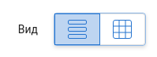
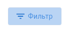

# Базовые элементы управления (контролы)

простые элементы управления, работающие с абстрактными данными (без предметной области) 

* [hm-group-btn](hm-group-btn/README.md)

  

* [hm-swiper](hm-swiper/README.md)

* [hm-switch-checkmark](hm-switch-checkmark/README.md)

  

* [hm-toggle-button](hm-toggle-button/README.md)

  

