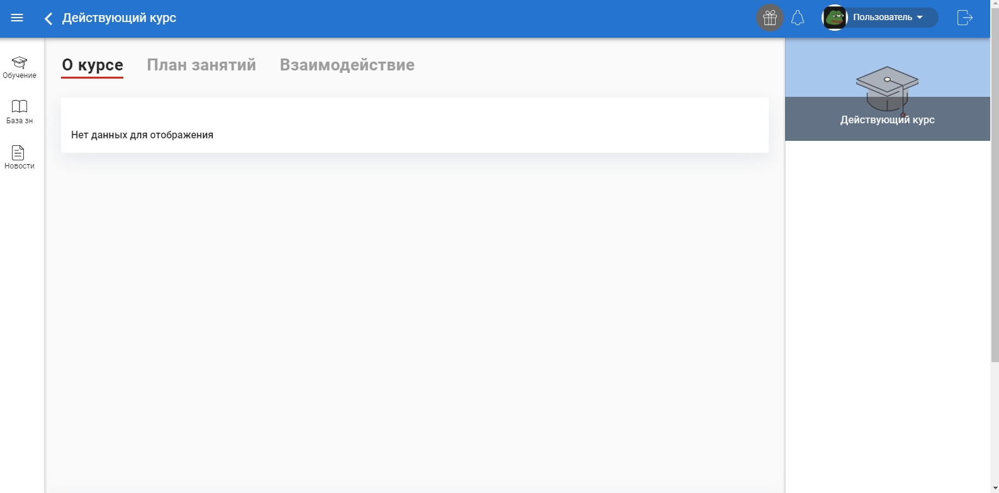
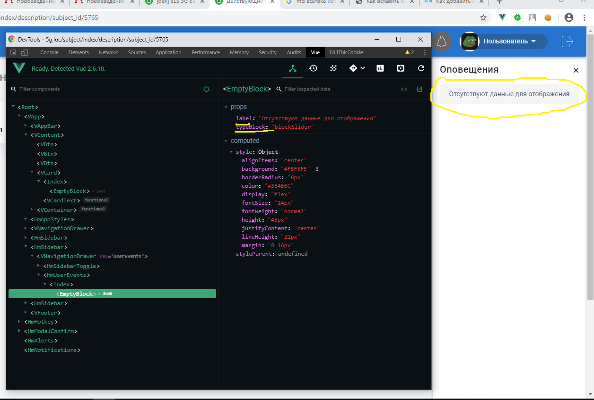
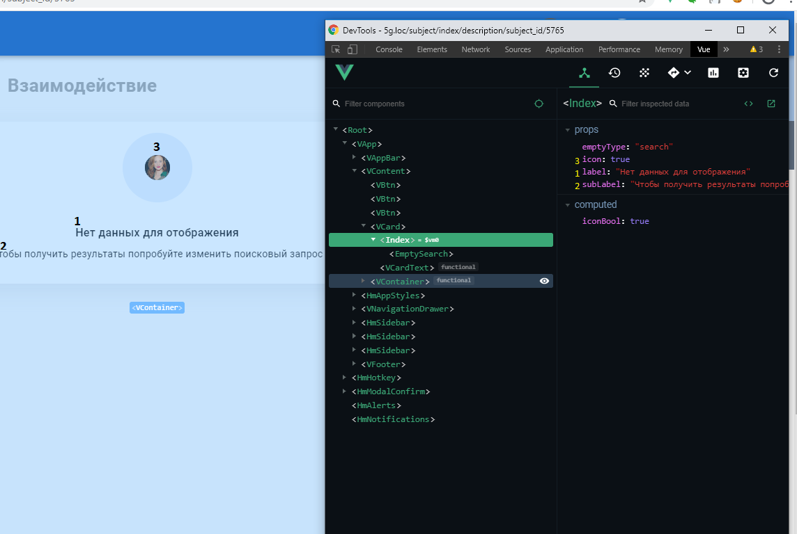

Компонент "отображение пустого котнента или поиска без результа"
Вызов компонента - <hm-empty/>
Компонент имеет 3 состояния (empty-type="")
- block (short)
    - отображает так же текст (label  - имеет дефолтное значение)

- blockSlider (передаеться) Тип для отображения в слайдере (empty-type="short-slider")
    - отображает так же текст (label  - имеет дефолтное значение)
    
- search (передаеться) Тип для отображения при неудолитворительном поиске (empty-type="full")
    Принимает параметры:
    - label    (1) - имеют default значение
    - subLabel (2) - имеют default значение
    - icon (3) - параметр отвечает за отобржение иконки (default = true)
    - комопнент так же может принять иконку (<hm-empty empty-type="search"></hm-empty>)
 
