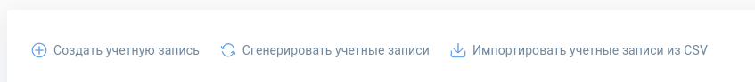

# Layout-компоненты

* [hm-interface-edit](./hm-interface-edit/README.md) - редактирование расположения виджетов на главной (url: `/interface/edit`) 

* [hm-context-menu-button](./hm-context-menu-button/README.md)

  

* [hm-material-responsive](./hm-material-responsive/README.md) - responsive-отображение материала с возможностью развёртывания на весь экран 

* [hm-partials-actions](./hm-partials-actions/README.md) -   отрисовка действий для текущей страницы (панель в содержимом слева сверху, под заголовком).

  
  
* [hm-widgets-composer](./hm-interface-edit/README.md) - делит виджеты на группы и оборачивает их в контейнеры для обхода ограничений css-вёрстки
