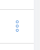

# hm-context-menu-button

`is-table-cell`, неактивно


`is-table-cell`, наведена мышь



## Пример использования

```
<hm-context-menu-button v-ref="refContextMenuButton"/>

<v-menu :activator="refContextMenuButton">
  <!-- . . . . . -->
</v-menu>
```
